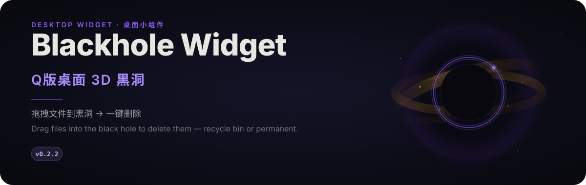

# Blackhole Widget

A cute (Q-version) desktop 3D black hole widget — drag files into it to delete them.


## Features

- 3D rotating black hole floating on your desktop (Three.js + Fresnel glow shader)
- Drag files onto the black hole to delete them (recycle bin or permanent)
- System tray menu: show/hide, zoom in/out, switch model, auto-start, settings, exit
- Multiple 3D black hole models with hot-switching (purple, gold, ice-blue, ray-traced lens, digital character, and custom GLB)
- Right-click drag to rotate the 3D view with inertia (release to auto-spin)
- Settings window: confirm before delete, permanent delete toggle
- Window is draggable to reposition

## Requirements

- Windows 10 / 11 (WebView2 built-in)
- [Node.js](https://nodejs.org/) 18+
- [Rust](https://rustup.rs/) 1.70+

## Quick Start

```bash
# Install dependencies
npm install

# Development mode (hot reload)
npm run tauri dev

# Production build
npm run tauri build
```

The built executable is at `src-tauri/target/release/blackhole-widget.exe` — run it directly, no installation needed.

## Tech Stack

| Layer | Technology |
|---|---|
| Desktop framework | Tauri v2 (Rust) |
| 3D rendering | Three.js + GLSL shaders |
| UI | Vue 3 |
| File deletion | `trash` crate (recycle bin) / `std::fs` (permanent) |
| Auto-start | `tauri-plugin-autostart` (Windows registry) |
| Settings persistence | JSON file (`%APPDATA%/blackhole-widget/`) |

## Project Structure

```
BlackholeWidget/
├── model-x/                # Sample GLB models for Model X
├── screenshots/             # README screenshots
├── src/                     # Vue frontend
│   ├── App.vue              # Main window (Three.js canvas + drag overlay)
│   ├── SettingsApp.vue      # Settings window
│   ├── settings-main.js     # Settings entry point
│   ├── assets/              # Static assets (textures, frames)
│   ├── composables/
│   │   ├── useBlackHole.js  # Three.js scene and animation
│   │   └── useFileDrop.js   # File drag-drop event handling
│   ├── models/              # 3D model definitions
│   │   ├── index.js         # Model registry
│   │   ├── model-1.js       # Model 1 (purple theme)
│   │   ├── model-2.js       # Model 2 (gold theme)
│   │   ├── model-3.js       # Model 3 (ice-blue theme)
│   │   ├── model-4.js       # Model 4 (ray-traced Schwarzschild lens)
│   │   ├── model-5.js       # Model 5 (Digi-Girl digital character)
│   │   ├── model-6.js       # Model 6 (Digi-Girl animated)
│   │   └── model-x.js       # Model X (universal GLB loader)
│   ├── shaders/             # GLSL shaders
│   └── styles/              # CSS styles
├── src-tauri/               # Tauri / Rust backend
│   └── src/
│       ├── main.rs          # Entry point + command registration
│       ├── tray.rs          # System tray + menu
│       ├── config.rs        # Settings I/O
│       └── file_ops.rs      # File deletion logic
├── utils/                   # Miscellaneous utilities
├── Model-X.md               # Model X usage guide (EN / ZH)
├── index.html               # Main window entry
├── settings.html            # Settings window entry
├── vite.config.js
└── package.json
```

## Changelog

### v0.2.2

- **Window size persistence**: window size is saved on zoom in/out and restored automatically on next startup
- **Model 4 animation fix**: replaced absolute time with a local delta-time accumulator and normalized rotation angles modulo 2π in the shader, fixing animation freeze or sluggishness after prolonged runtime
- **WebGL context recovery**: if the GPU driver resets (context lost), the scene is automatically rebuilt and animation resumes

### v0.2.1

- **Model X fixes**:
  - Fixed UI freeze when loading large `.glb` files via raw binary IPC transfer (`tauri::ipc::Response`)
  - Fixed PBR textures rendering in WebView2 by switching to `GLTFLoader.parse(ArrayBuffer)` instead of blob URLs
  - Fixed embedded texture silent failures by adopting Tauri asset protocol for model loading

### v0.2.0

- **Model X** (new): universal GLB model loader — select any `.glb` file via system tray to load and render with built-in animations
- **Sample GLB models**: Earth Cartoon and Blackhole from Sketchfab (CC Attribution) included in `model-x/`
- **Model X documentation**: usage guide with attribution in `Model-X.md`

### v0.1.5

- **Fix**: Implemented a local time accumulator for Model 4 to fix animation freezing when switching models.
- **Tweak**: Fine-tuned lighting effects on Model 6.

### v0.1.4

- **Model 6** (new): Digi-Girl digital character (animated)

### v0.1.3

- **Model 5** (new): Digi-Girl digital character
- **Model hot-switch enhancement**: group rotation resets to identity on model switch, letting each model set its own default view angle

### v0.1.2

- **Model 3** (new): ice-blue theme — cool white Fresnel glow + ice-blue accretion disk + cyan-blue photon ring + white-to-blue gradient particles
- **Model 4** (new): ray-traced lens black hole — Schwarzschild geodesic ray marching, FBM turbulent accretion disk, Doppler beaming, bloom, renders entirely in a fragment shader

### v0.1.1

- **Model system**: 3D model code extracted from `useBlackHole.js` into standalone model files (`src/models/`), with support for dynamic hot-switching
- **Model 1** (default): purple Fresnel glow + orange accretion disk + purple photon ring
- **Model 2** (new): shimmering gold theme — goldenrod accretion disk, bright gold outer ring, cream-gold photon ring, 500 gradient gold particles
- **Tray menu "Switch Model"**: right-click tray icon → Switch Model submenu, with checkmark showing the active model, supports runtime switching
- **Model persistence**: last selected model is remembered and restored on next startup
- **Right-click drag to rotate**: hold right mouse button on the widget to rotate the 3D view, auto-rotation resumes on release

### v0.1.0

- Initial release: 3D black hole widget, drag-and-drop file deletion, system tray menu, settings window

## License

MIT

---

# Blackhole Widget

Q版 桌面 3D 黑洞小组件 — 将文件拖入黑洞即可删除。

## 功能

- 3D 旋转黑洞悬浮在桌面上（Three.js + Fresnel 辉光着色器）
- 将文件拖到黑洞上 → 删除到回收站（或永久删除）
- 系统托盘菜单：显示/隐藏、放大/缩小、切换模型、开机启动、设置、退出
- 多种 3D 黑洞模型可热切换（紫色、金色、冰蓝、射线追踪透镜、数字角色、自定义 GLB）
- 右键拖拽旋转 3D 视角，松开后惯性旋转
- 设置窗口：删除前确认、永久删除开关
- 窗口可拖拽移动位置

## 环境要求

- Windows 10 / 11（内置 WebView2）
- [Node.js](https://nodejs.org/) 18+
- [Rust](https://rustup.rs/) 1.70+

## 快速开始

```bash
# 安装依赖
npm install

# 开发模式（热更新）
npm run tauri dev

# 生产构建
npm run tauri build
```

构建产物位于 `src-tauri/target/release/blackhole-widget.exe`。

## 技术栈

| 层 | 技术 |
|---|---|
| 桌面框架 | Tauri v2 (Rust) |
| 3D 渲染 | Three.js + GLSL 着色器 |
| UI | Vue 3 |
| 文件删除 | `trash` crate（回收站）/ `std::fs`（永久） |
| 开机启动 | `tauri-plugin-autostart`（注册表） |
| 设置持久化 | JSON 文件 (`%APPDATA%/blackhole-widget/`) |

## 项目结构

```
BlackholeWidget/
├── model-x/                # 模型X号示例 GLB 模型
├── screenshots/             # README 截图
├── src/                     # Vue 前端
│   ├── App.vue              # 主窗口（Three.js 画布 + 拖放叠加层）
│   ├── SettingsApp.vue      # 设置窗口
│   ├── settings-main.js     # 设置入口
│   ├── assets/              # 静态资源（纹理、帧图）
│   ├── composables/
│   │   ├── useBlackHole.js  # Three.js 场景和动画
│   │   └── useFileDrop.js   # 文件拖放事件处理
│   ├── models/              # 3D 模型定义
│   │   ├── index.js         # 模型注册表
│   │   ├── model-1.js       # 模型1号（紫色主题）
│   │   ├── model-2.js       # 模型2号（金色主题）
│   │   ├── model-3.js       # 模型3号（冰蓝主题）
│   │   ├── model-4.js       # 模型4号（施瓦西射线追踪透镜）
│   │   ├── model-5.js       # 模型5号（Digi-Girl 数字角色）
│   │   ├── model-6.js       # 模型6号（Digi-Girl 动态版本）
│   │   └── model-x.js       # 模型X号（通用 GLB 加载器）
│   ├── shaders/             # GLSL 着色器
│   └── styles/              # CSS 样式
├── src-tauri/               # Tauri / Rust 后端
│   └── src/
│       ├── main.rs          # 入口 + 命令注册
│       ├── tray.rs          # 系统托盘 + 菜单
│       ├── config.rs        # 设置读写
│       └── file_ops.rs      # 文件删除逻辑
├── utils/                   # 杂项工具
├── Model-X.md               # 模型X号使用说明（中英双语）
├── index.html               # 主窗口入口
├── settings.html            # 设置窗口入口
├── vite.config.js
└── package.json
```

## 更新日志

### v0.2.2

- **窗口大小持久化**：托盘放大/缩小后保存窗口大小，下次启动自动恢复
- **模型4号动画修复**：着色器时间改用局部增量累加，并将旋转角取模 2π，修复长时间运行后动画停止或卡顿的问题
- **WebGL context 容错**：GPU 驱动重置（context lost）后自动重建场景并恢复动画

### v0.2.1

- **模型X号修复**：
  - 修复加载大 `.glb` 文件时的 UI 冻结问题，改用原始二进制 IPC 传输（`tauri::ipc::Response`）
  - 修复 WebView2 环境下 PBR 贴图渲染改用 `GLTFLoader.parse(ArrayBuffer)` 替代 blob URL
  - 修复内嵌贴图静默加载失败的问题，改用 Tauri asset 协议加载模型

### v0.2.0

- **模型X号**（新增）：通用 GLB 模型加载器 — 通过系统托盘选择任意 `.glb` 文件，自动适配内建动画进行渲染
- **示例 GLB 模型**：来自 Sketchfab 的 Earth Cartoon 和 Blackhole（CC Attribution），存放在 `model-x/`
- **模型X号使用说明**：使用指南，含署名信息，见 `Model-X.md`
- **托盘左键切换**：左键点击托盘图标即可切换窗口显示/隐藏，与托盘菜单的切换功能保持一致

### v0.1.5

- **修复**：模型4号改用局部时间累加器，解决模型切换时模型4号的动画冻结问题
- **微调**：模型6号微调了灯光效果

### v0.1.4

- **模型6号**（新增）：Digi-Girl 数字角色（动态）

### v0.1.3

- **模型5号**（新增）：Digi-Girl 数字角色 
- **模型切换增强**：切换模型时 group 旋转归零，让每个模型自行设定默认视角

### v0.1.2

- **模型3号**（新增）：冰蓝主题 — 冷白菲涅尔发光 + 冰蓝吸积盘 + 青蓝光子环 + 白→天蓝→深蓝渐变粒子
- **模型4号**（新增）：透镜黑洞 — 施瓦西测地线积分、FBM 湍流吸积盘、Doppler 效应、bloom，全部在片段着色器中渲染

### v0.1.1

- **模型系统**：3D 模型代码从 `useBlackHole.js` 抽离为独立模型文件（`src/models/`），支持动态切换
- **模型1号**（默认）：紫色主题 — 菲涅尔发光 + 橙色吸积盘 + 紫色光子环
- **模型2号**（新增）：金色主题 — 金菊色吸积盘、亮金外圈、奶油金光子环、500 颗渐变金粒子
- **托盘菜单「切换模型」**：右键托盘图标 → 切换模型子菜单，勾选显示当前模型，支持运行时热切换
- **模型选择持久化**：下次启动自动使用上次选择的模型
- **右键拖拽旋转**：在黑洞窗口上按住右键拖动可 3D 旋转视角，松开后恢复自动旋转

### v0.1.0

- 初始版本：3D 黑洞小组件、拖放文件删除、系统托盘菜单、设置窗口

MIT
